## Part 1:
### Selecting species and calculating acuity

CPD info from Martin, G. R. (2017). The sensory ecology of birds. Oxford University Press

List of selected Bird Species, their acuities in CPD, and MRA

Arranged in order of acuity scores from worst to best

| Species | Acuity (CPD) | Acuity (MRA)
|:---:|:---:|:---:
| Western Barn Owl (*Tyto alba*) | 4.0  | .25
| House Sparrow (*Passer domesticus*) | 4.8 | .21
| Carolina Chickadee (*Poecile carolinensis*) | 5.0 |.20
| Sacred Kingfisher (*Todiramphus sanctus*) | 26.0 |.038
| Rook (*Corvus frugilegus*) | 29.5 | .033

## Part 2
### Selecting images for animals to "look at"
All photos taken by me in Keith County Nebraska and Tulsa, Oklahoma

Western Barn Owl will look at a rattlesnake. Snakes are relevant to owls as both potentail prey and predator.

House Sparrow will look at a train. Cliff Swallow colonies, a frequent House Sparrow hang out spot, are often found in train tunnel culverts. As urban birds House Sparrows need to be aware of vehicles to avoid collision

The Carolina Chickadee will look at the bird feeder on my porch.  Exactly one Carolina Chickadee has been observed at my feeder. Maybe more don't come because they can't see it.  (More likely because of the large number of HOSP's and EUST's, but you never know.)

The Sacred Kingfisher will exaimine some fish of undetermined species.  While these fish are bigger than the kingfisher's typical prey and whatever this fish is probably has no contact with a Sacred Kingfisher, this photo is useful as it shows the fish through the water, which is what a Kingfisher would have to do to catch fish

The Rook will examine a Turkey Vulture.  This is also more a symbolic observation as Turkey Vultures are North American and Rooks are European, but both are high-flying black birds, and I want to see how a bird might see a bird similiar to itself in flight.

## Part 3
### Generate images of what animals would see at different distances.
I added 50m as that seems more like a scale that birds might have to observe some things at 

| Species looking | 1 m | 2 m | 3m | 50m
|:---:|:---:|:---:|:---:|:---:
| Western Barn Owl | 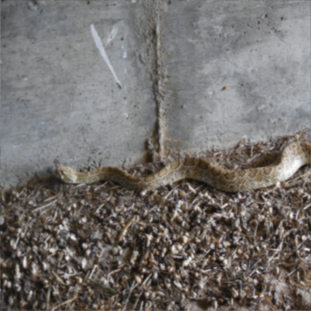|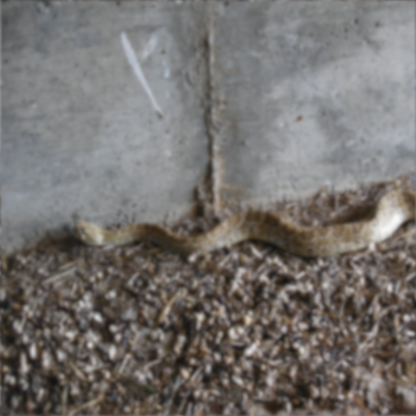 |  |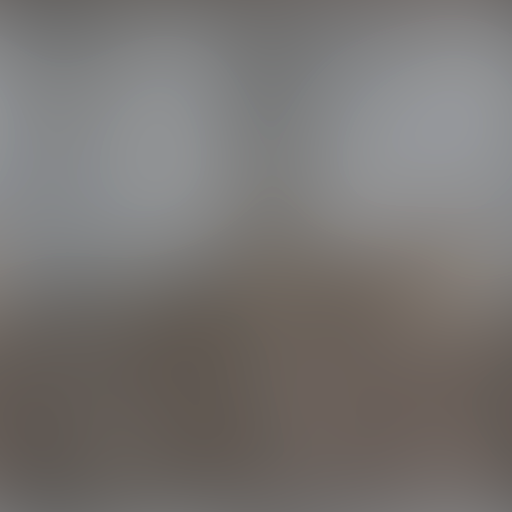
| House Sparrow| |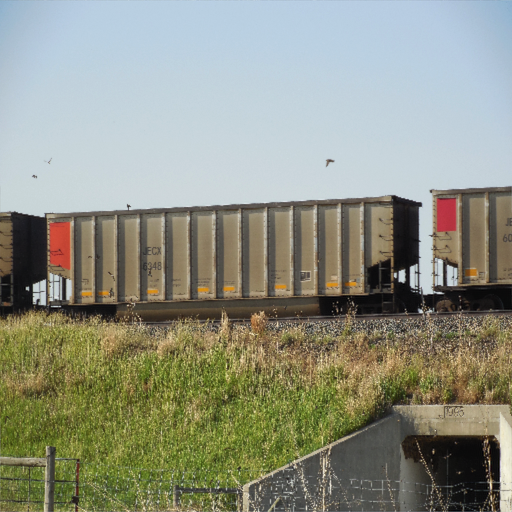 | 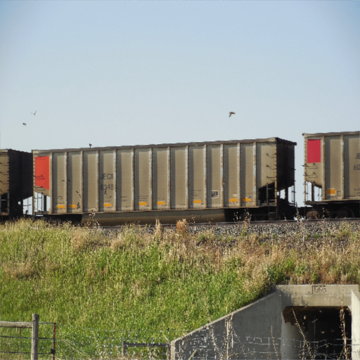 |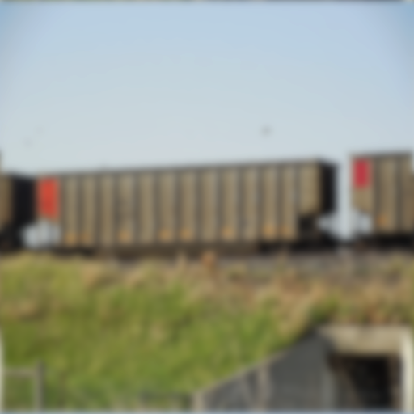
| Carolina Chickadee | |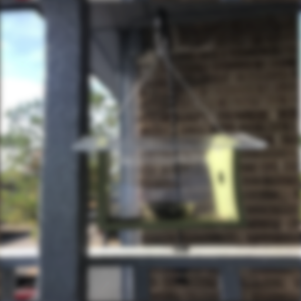 | 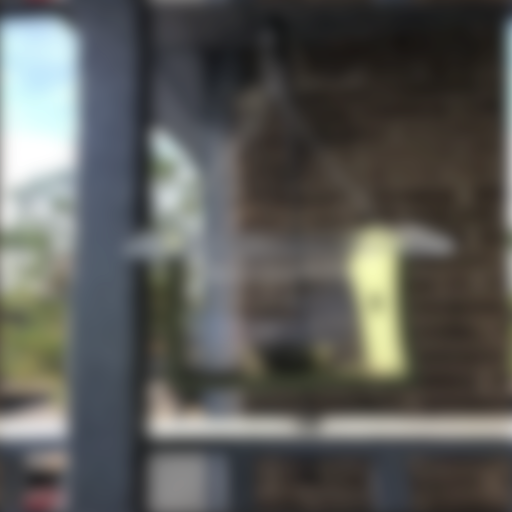 |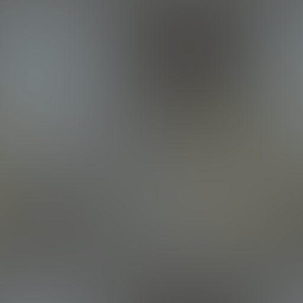
| Sacred Kingfisher | 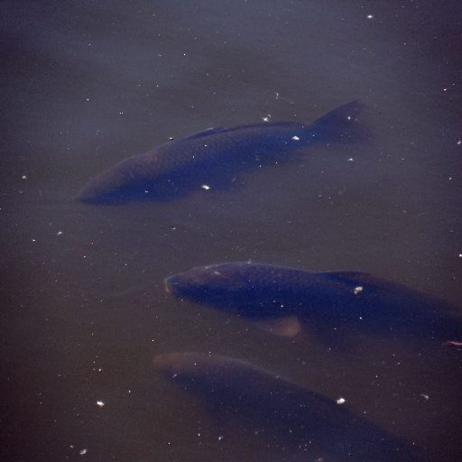|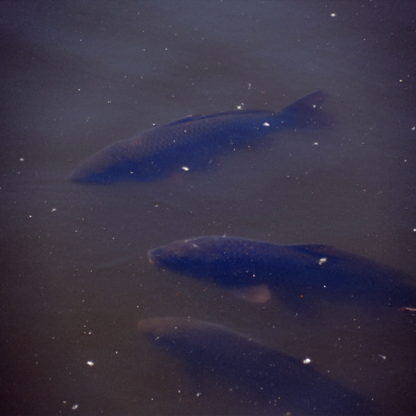 |  |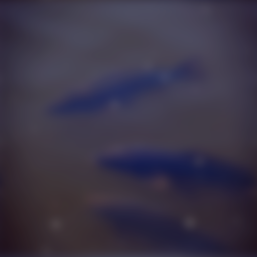
| Rook | | | 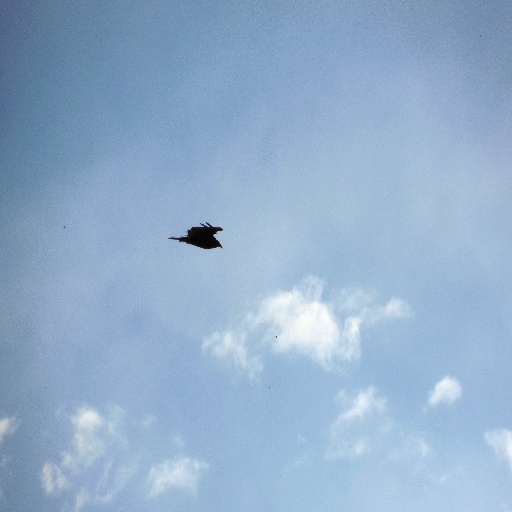 |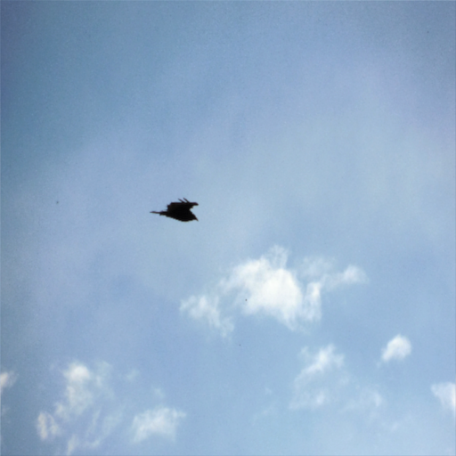

## Link to R_script to generate photos

[Mierow seminar assignment script](Acuity_script.R)

