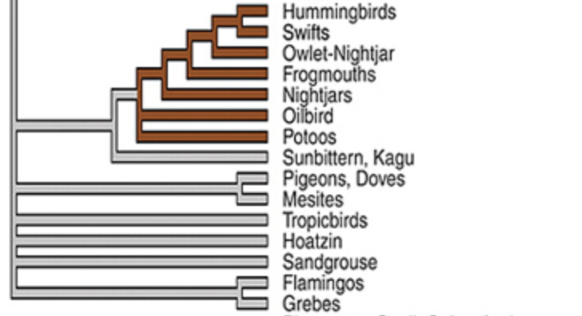

Phylogeny tree image data was taken from




Load necessary libraries
```{r, message=FALSE}
library(phytools)
library(geiger)
library(diversitree)
library(mapplots)
```


Code to create the tree with selected families
```{r}
#Delineate relationship between birds using parentheses
birdphylo<-"(Ostriches,((Flamingos,Grebes), Pigeons, Hoatzin, (Potoos,(Nightjars,(Swifts, Hummingbirds)))));"

#read the data
birds<-read.tree(text = birdphylo)

#create tree
plotTree(birds, ftype="reg", label.offset=.2)

#plot tree with different branch color
plot(birds,  edge.color = ("blue"),label.offset=.2)
```


